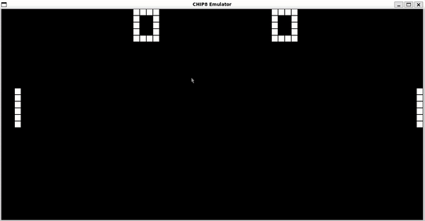

# CHIP-8 Emulator



A high-quality CHIP-8 emulator written in C. Includes the SDL2 development library to allow for graphics, input, sound, and timer support.

## Table of Contents

- [Features](#features)
- [Getting Started](#getting-started)
- [Usage](#usage)
- [Games and Programs](#games-and-programs)
- [Keyboard Controls](#keyboard-controls)
- [Contributing](#contributing)
- [License](#license)

## Features

- **Accuracy:** Faithfully emulates the CHIP-8 virtual machine, running classic games flawlessly.
- **Cross-Platform:** Works seamlessly on Windows, macOS, and Linux.
- **Customizable:** Configure settings like display scale and key mappings to suit your preferences.
- **Built-in Debugger:** Debug and inspect your programs with ease.
- **Dynamic Sound:** Experience the nostalgic beeps and boops with sound support.

## Getting Started

Follow these instructions to get your CHIP-8 emulator up and running.

### Prerequisites

- [SDL2] (https://wiki.libsdl.org/SDL2/Installation)

### Installation

1. Clone the repository: `git clone https://github.com/osarana/CHIP-8-Emulator.git`
2. Build the emulator: `make`
3. Run the emulator: `./chip8 <path-to-ROM-file>`

## Usage

```bash
# Example command to start a game
./chip8 roms/game.ch8

Provide step-by-step instructions on how to use your emulator, including loading ROMs, starting games, and configuring settings. You can also include code snippets for common tasks.

```bash
# Example command to start a game
./chip8 roms/game.ch8
